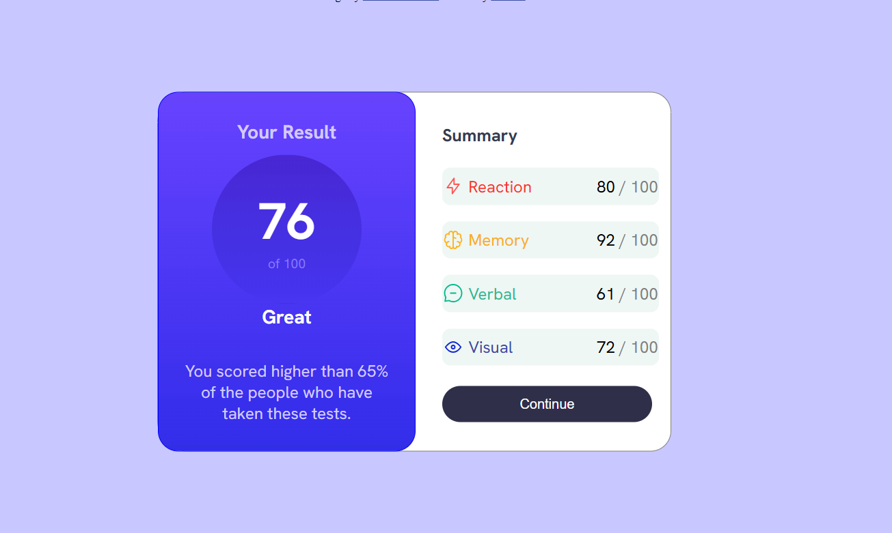

# Frontend Mentor - Results summary component solution

This is a solution to the [Results summary component challenge on Frontend Mentor](https://www.frontendmentor.io/challenges/results-summary-component-CE_K6s0maV). Frontend Mentor challenges help you improve your coding skills by building realistic projects. 

## Table of contents

- [Overview](#overview)
  - [The challenge](#the-challenge)
  - [Screenshot](#screenshot)
  - [Links](#links)
- [My process](#my-process)
  - [Built with](#built-with)
  - [What I learned](#what-i-learned)
  - [Continued development](#continued-development)
  - [Useful resources](#useful-resources)
- [Author](#author)
- [Acknowledgments](#acknowledgments)

Perfect — that Markdown section you shared is from a **Frontend Mentor README template**. Let’s fill it out completely for your **Results Summary Component** challenge.

Here’s a clean, realistic example you can use 👇

---

````markdown
# Frontend Mentor - Results Summary Component Solution

This is a solution to the [Results Summary Component challenge on Frontend Mentor](https://www.frontendmentor.io/challenges/results-summary-component-CE_K6s0maV).  
Frontend Mentor challenges help you improve your coding skills by building realistic projects.

## Overview

### The challenge

Users should be able to:

- See hover and focus states for all interactive elements on the page.
- View the optimal layout depending on their device’s screen size.
- See their result and summary section displayed side by side on larger screens and stacked on smaller screens.

### Screenshot



### Links

- Solution URL: [Add your solution URL here](#)
- Live Site URL: [Add your live site URL here](#)

## My process

### Built with

- Semantic **HTML5** markup  
- **CSS Flexbox** for layout  
- **Responsive design** principles  
- **Google Fonts** – Hanken Grotesk  
- Basic **box-shadow** and **gradient backgrounds**

### What I learned

This challenge helped me strengthen my understanding of **Flexbox alignment** and **responsive card layouts**.  
I also learned how to:
- Create circular score indicators using border-radius and gradients.
- Center items properly using `align-items` and `justify-content`.
- Handle equal height sections in Flexbox layouts.

Example snippet:

```css
.score {
  background: linear-gradient(to bottom, hsl(252, 100%, 67%), hsl(241, 81%, 54%));
  color: white;
  width: 120px;
  height: 120px;
  border-radius: 50%;
  display: flex;
  align-items: center;
  justify-content: center;
}
````

### Continued development

In future projects, I want to focus more on:

* Improving responsive layouts with **CSS Grid**.
* Using **custom properties (CSS variables)** for theme colors.
* Transitioning this project into a **React component** for practice.

### Useful resources

* [MDN Web Docs - Flexbox Guide](https://developer.mozilla.org/en-US/docs/Learn/CSS/CSS_layout/Flexbox)
* [CSS Tricks - Complete Guide to Flexbox](https://css-tricks.com/snippets/css/a-guide-to-flexbox/)
* [Frontend Mentor community](https://www.frontendmentor.io/community) for design feedback.

## Author

* Frontend Mentor – [@yourusername](https://www.frontendmentor.io/profile/yourusername)
* GitHub – [@yourgithubhandle](https://github.com/yourgithubhandle)

## Acknowledgments

Thanks to the Frontend Mentor community for reviewing and providing feedback on layouts and responsive design practices.

```

---

Would you like me to tailor it **specifically in your name (“Mohammed Khaisar”)** and include your GitHub link if you share it?  
That’ll make it ready to paste directly into your project’s `README.md`.
```
